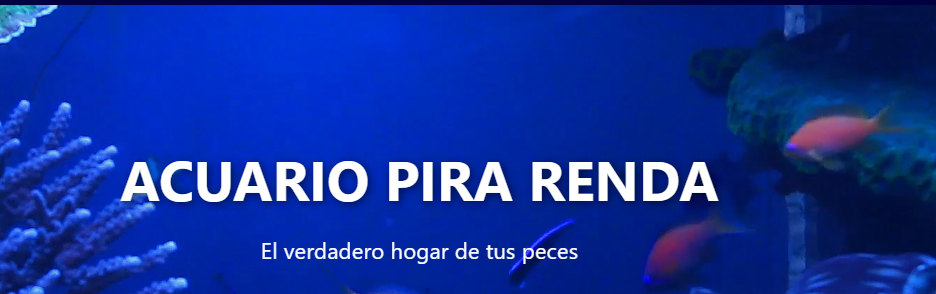
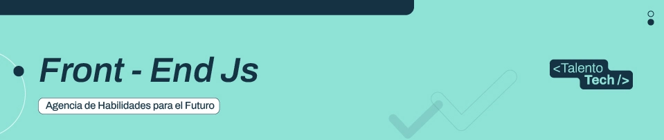

### Proyecto integrador para el curso **Front-End JS — TT Adultos — 1C 2026** · Talento Tech



---

🔗 [Ver sitio en vivo](https://delcyvillalba.github.io/Acuario-Pira-Renda/)


---

### Descripción

Sitio web de una tienda de acuarios llamada **Pira Renda** (nombre guaraní que significa **"Lugar de Peces"**). Funciona como un e-commerce estático con catálogo de productos, carrito de compras persistente, atlas interactivo de especies acuáticas y un panel de administración para gestionar el contenido.

---

## Tecnologías

| Tecnología | Uso |
|---|---|
| HTML5 semántico | Estructura de todas las páginas |
| CSS3 (archivos por página) | Estilos con Flexbox, Grid y Media Queries |
| JavaScript vanilla | Interactividad, carrito, filtros, paginación |
| Web Crypto API | Hash SHA-256 para credenciales del admin |
| Font Awesome 6 | Iconografía |
| Formspree | Envío del formulario de contacto |

---

## Páginas

### Sitio público

| Archivo | Descripción |
|---|---|
| `index.html` | Inicio con hero en video, productos destacados y accesos directos |
| `tienda.html` | Tienda con filtros por categoría, paginación y carrito |
| `carrito.html` | Resumen del carrito con cálculo de totales |
| `checkout.html` | Proceso de compra en 3 pasos con tarjeta visual |
| `atlas.html` | Atlas de especies con filtros, paginación y ficha técnica modal |
| `guia.html` | Guía de cuidados para principiantes con acordeón de preguntas |
| `productos_info.html` | Hub de categorías de productos |
| `cat_acuarios.html` | Catálogo de acuarios y peceras |
| `cat_bombas.html` | Catálogo de bombas |
| `cat_filtros.html` | Catálogo de filtros |
| `cat_skimmers.html` | Catálogo de skimmers |
| `cat_aditivos.html` | Catálogo de aditivos |
| `cat_decoracion.html` | Catálogo de plantas y decoración |
| `acerca_de.html` | Historia y valores de la tienda |
| `contacto.html` | Información de contacto, formulario y mapa |
| `atencion_cliente.html` | Centro de atención al cliente |
| `faq.html` | Preguntas frecuentes |
| `envio.html` | Políticas de envío y devoluciones |

### Panel de administración

| Archivo | Descripción |
|---|---|
| `login.html` | Inicio de sesión con autenticación por hash SHA-256 |
| `admin/index.html` | Panel para gestionar productos y especies del catálogo |

---

## Funcionalidades destacadas

- **Carrito persistente** — se guarda en `localStorage` y se mantiene entre páginas y sesiones
- **Drawer lateral** — carrito accesible desde cualquier página sin salir de ella
- **Tienda** — filtros por categoría, búsqueda en tiempo real y paginación (10 por página)
- **Atlas de especies** — 5 tipos filtrables (agua dulce, salada, tropical, caracoles, axolotes), paginación y modal con ficha técnica completa
- **Checkout en 3 pasos** — datos personales → método de pago → confirmación con tarjeta animada
- **Panel de administración** — altas, bajas y modificaciones de productos y especies; exportación de JSON actualizado
- **Breadcrumb dinámico** — rastrea la página de origen para una navegación coherente
- **Autenticación segura** — las credenciales del admin se almacenan como hash SHA-256.
- **Formulario de contacto** — validación en tiempo real y envío vía Formspree
- **Diseño responsivo** — adaptado a móvil, tablet y escritorio en todas las páginas

---

## Estructura de archivos

```
/
├── index.html
├── login.html
├── tienda.html
├── carrito.html
├── checkout.html
├── atlas.html
├── guia.html
├── contacto.html
├── acerca_de.html
├── productos_info.html
├── cat_acuarios.html
├── cat_bombas.html
├── cat_filtros.html
├── cat_skimmers.html
├── cat_aditivos.html
├── cat_decoracion.html
├── atencion_cliente.html
├── faq.html
├── envio.html
│
├── admin/
│   ├── index.html
│   ├── admin.css
│   └── admin.js
│
├── css/
│   ├── base.css          ← estilos globales y componentes compartidos
│   ├── login.css
│   ├── index.css
│   ├── tienda.css
│   ├── carrito.css
│   ├── checkout.css
│   ├── atlas.css
│   ├── guia.css
│   ├── contacto.css
│   ├── acerca_de.css
│   ├── atencion_cliente.css
│   └── productos_info.css
│
├── js/
│   ├── utils.js          ← utilidades compartidas (shuffle)
│   ├── script.js         ← comportamientos globales (video hero, menú, chat)
│   ├── drawer.js         ← drawer del carrito y contador global
│   ├── login.js
│   ├── tienda.js
│   ├── carrito.js
│   ├── checkout.js
│   ├── atlas.js
│   ├── guia.js
│   └── contacto.js
│
├── data/
│   ├── productos.json    ← catálogo de productos
│   └── especies.json     ← catálogo de especies del atlas
│
└── assets/
    └── img/
        ├── logo-acuario.png
        └── pescado.png          ← placeholder cuando una imagen no carga
```

---

## Configuración

> Las imágenes de productos y especies se cargan desde URLs externas definidas en `data/productos.json` y `data/especies.json`. Para usar imágenes locales, guardarlas en `assets/img/` y actualizar las rutas en los JSON correspondientes.

### Formulario de contacto

El formulario usa **Formspree**. Para activarlo, reemplazar `YOUR_FORM_ID` en `contacto.html` con el ID del formulario generado en [formspree.io](https://formspree.io).

### Credenciales del panel de administración

Las credenciales están en `js/login.js`. La contraseña se almacena como hash SHA-256. Para cambiarla, obtener el hash del nuevo valor desde la consola del navegador:

```js
crypto.subtle.digest('SHA-256', new TextEncoder().encode('nuevaContraseña'))
  .then(b => console.log([...new Uint8Array(b)].map(x => x.toString(16).padStart(2,'0')).join('')))
```

Luego reemplazar el valor de `passwordHash` en `login.js`.

---

## Autora

**Delcy Villalba**
Curso Front-End JS — TT Adultos — 1C 2026 · Talento Tech
